# Weather Explorer

A Django application for searching cities, exploring historical weather,
and viewing experimental daily mean-temperature forecasts. This app can
pull from open-meteo's extensive store of historical weather observations
and generate a 7-day mean temp forecast after the most-recently pulled date.

This app was intentionally kept simple as global weather is a complex and
highly unpredictable system. The primary goals were to experiment with machine
learning to make predictions and explore some of the most appropriate
development tools for this process.

## Features

- Search for cities and choose the correct region and country.
- Import historical weather for a selected city and date range.
- Explore weather observations with filters, charts, and summary statistics.
- Generate and save seven-day temperature forecasts.
- Evaluate forecasts against historical seasonal baselines.

## Technology

Python, Django, PostgreSQL, pandas, scikit-learn, and Open-Meteo.

## Local setup

These instructions use a macOS/Linux terminal and require Python and
a running PostgreSQL server.

1. Clone the repository and open its directory.

2. Create and activate a virtual environment:

   ```bash
   python3 -m venv venv
   source venv/bin/activate
   ```

3. Install dependencies:

   ```bash
   python -m pip install -r requirements.txt
   ```

4. Create a PostgreSQL database named `weather_db`, owned by the database
   user you intend to use.

5. Copy the example configuration:

   ```bash
   cp .env.example .env
   ```

6. Edit `.env` with your database connection details and a generated
   Django secret key. Generate a key with:

   ```bash
   python -c "import secrets; print(secrets.token_urlsafe(50))"
   ```

   Keep `.env` private. `DJANGO_DEBUG=True` is for local development.

7. Apply migrations and start the server:

   ```bash
   python manage.py migrate
   python manage.py runserver
   ```

8. Open http://127.0.0.1:8000/.

## Using the app

1. Search for a city.
2. Select the matching region and country.
3. Choose **Import Historical Weather for This City**.
4. Enter a historical date range and submit.
5. Explore the imported observations.

A short import is sufficient to demonstrate the history page.
For meaningful forecasting experiments, import several years of
continuous daily observations.

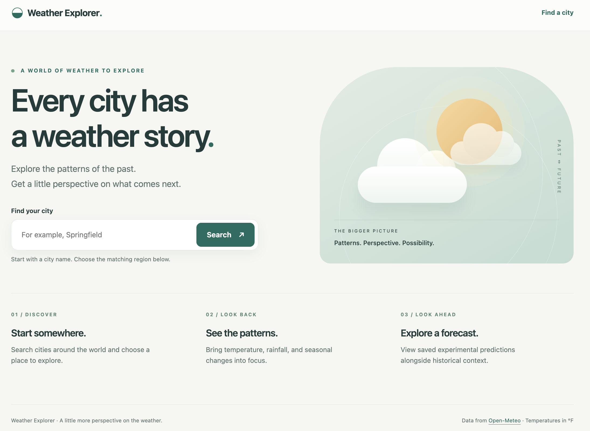

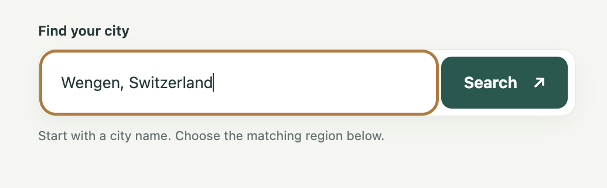

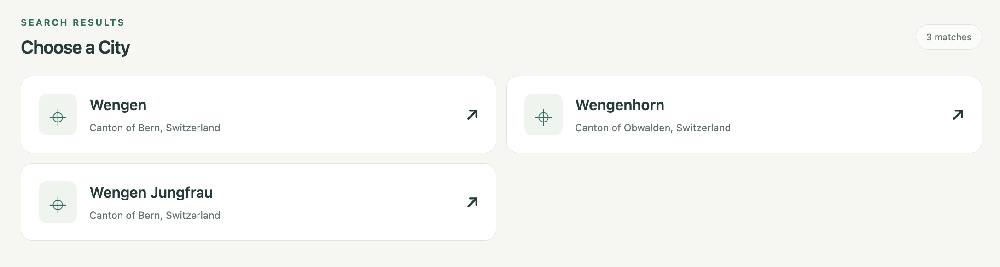

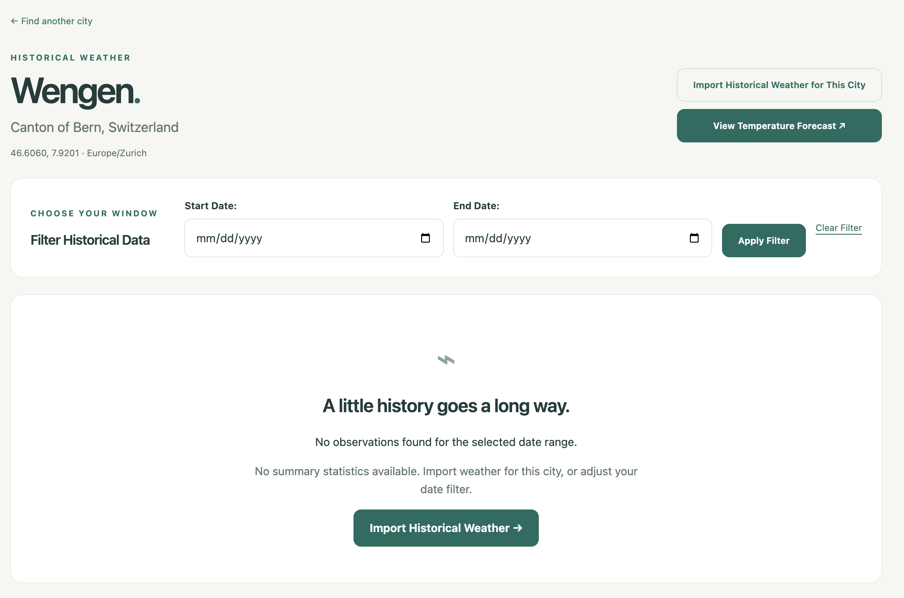

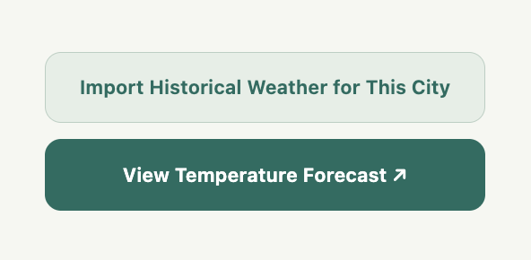

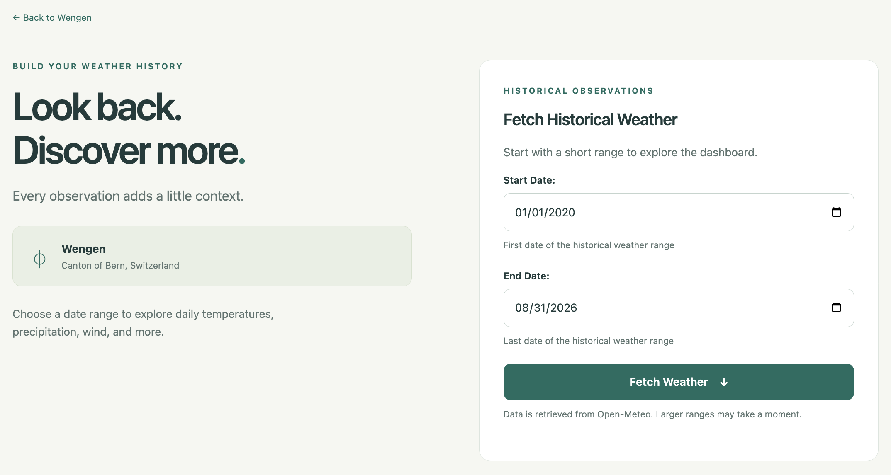

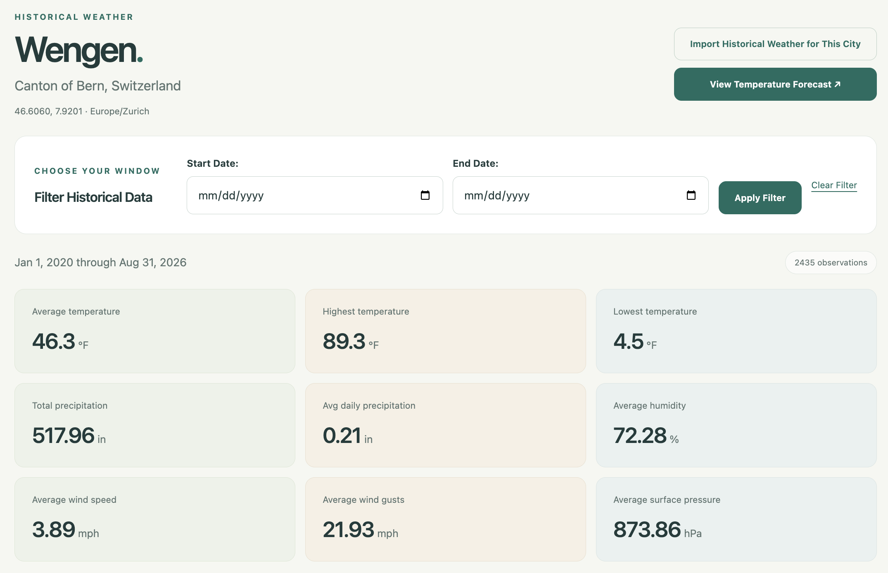

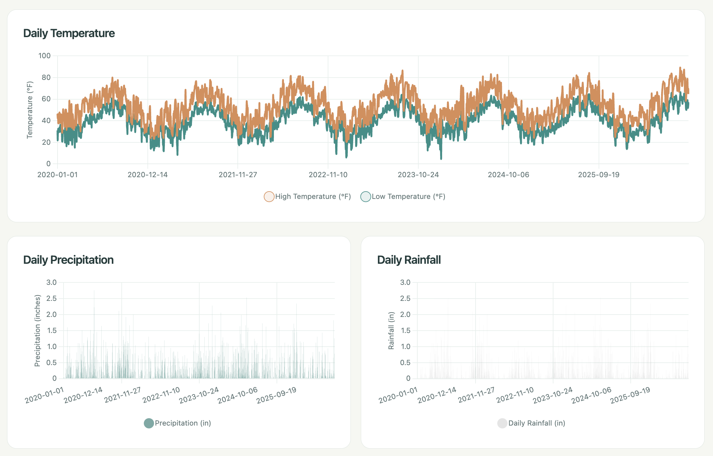

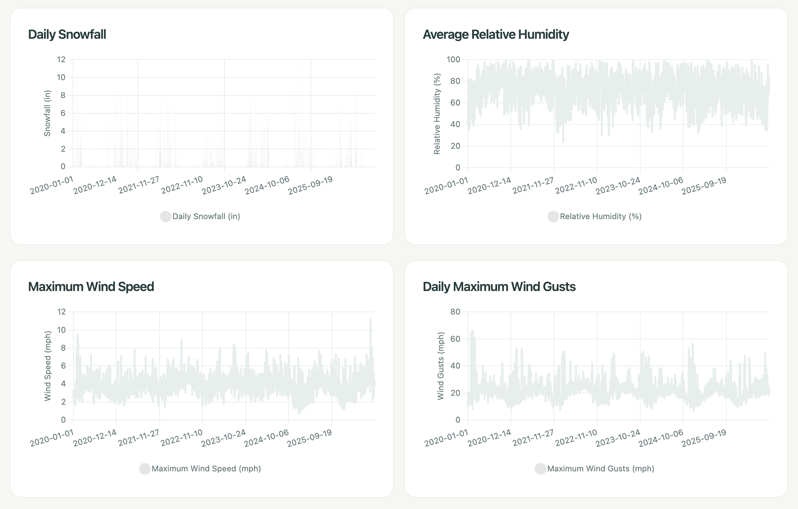

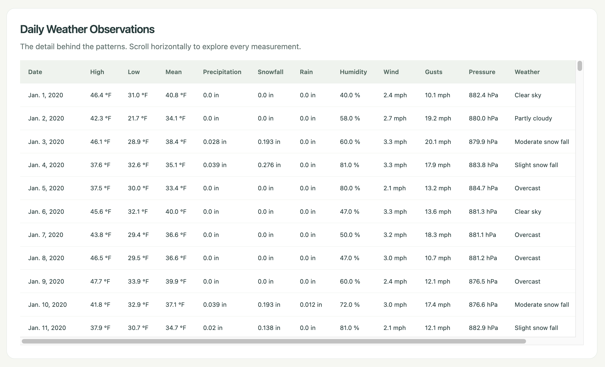

## Generating forecasts

Open a city’s **Forecast** page and select **Generate 7-day forecast**.
The page saves and displays the predictions when generation completes.
Import historical weather first if the city has no observations.

You can also generate forecasts through a management command.

Find the selected city's database ID in its history-page URL:
`/weather/4/` means the location ID is `4`.

Generate and save seven forecast days:

```bash
python manage.py generate_forecast 4
```

Replace `4` with your location's ID.

Then open **View Temperature Forecast** in the app.

The forecast begins after the latest stored observation, not necessarily
today. Historical imports therefore produce historical forecast dates.

Generation trains a separate Random Forest for each forecast horizon.
It saves predictions to PostgreSQL and updates existing predictions
for the same location, forecast origin, and target date.

The webpage displays up to seven days from the latest saved forecast
origin. Viewing the page does not train models; submitting the generation form does.

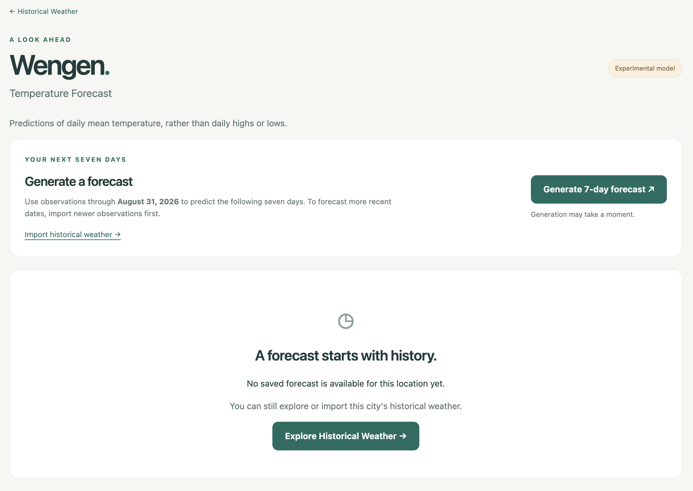

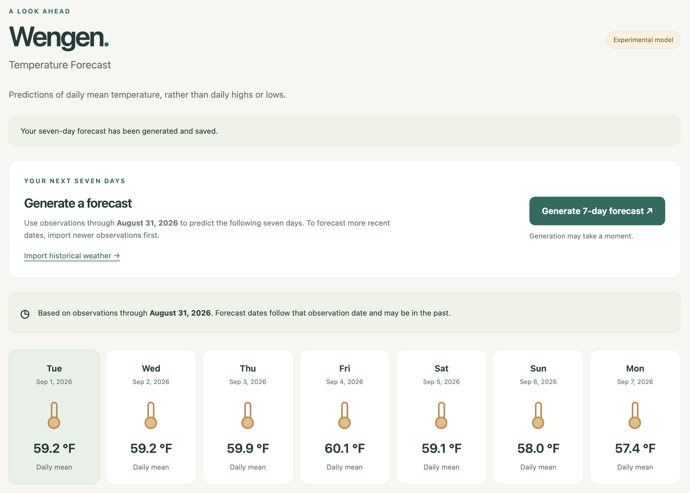

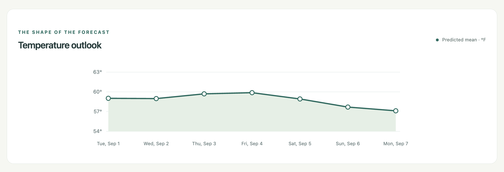

## Evaluation

The project includes historical backtesting and comparisons with
seasonal baseline predictions.

Across 12 sampled forecast windows issued in 2024:

- Model MAE: approximately 6.12 °F.
- Seasonal baseline MAE: approximately 6.72 °F.
- Overall MAE reduction: approximately 9%.
- First-week MAE reduction: approximately 18%.

First-week improvement also appeared in the sampled 2023 results,
but second-week performance was inconsistent between years.

These measurements describe the evaluated location and forecast windows.
They do not establish performance for every city or future period.

## Limitations

- Predictions estimate daily mean temperature, not daily highs or lows.
- The model is experimental and has not been benchmarked against
  professional weather forecasts.
- Forecast quality depends on the amount and completeness of imported data.
- Imports and forecast generation are manual; there are no scheduled updates.
- City search and weather imports require an internet connection.
- This setup is intended for local development.

## Tests

```bash
python manage.py test weather
```

Tests cover imports, forms, views, forecasting, backtesting, and saved
forecast behavior. Django creates a separate test database, so the
configured PostgreSQL user needs permission to create databases.

## Data source

City search and historical weather are provided by
[Open-Meteo](https://open-meteo.com/).
